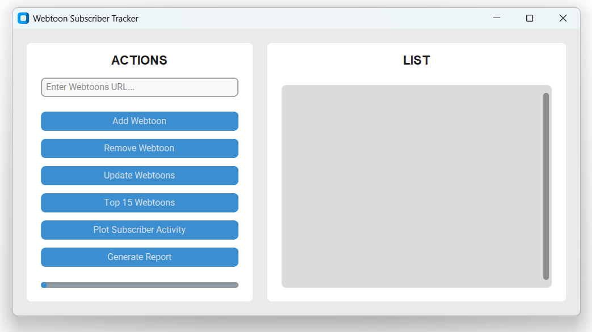

# Webtoons Subscriber Tracker
This is a Python web scraper for Webtoons. It uses the URLs as keys to record, track, and display monthly subscriber activity.

## Features
- **Add Webtoon:** Record Webtoons titles and current subscribers by copying and pasting the URL.
- **Remove Webtoon:** Easily delete Webtoons and all their data by inputting the URL or using the list.
- **Update Webtoons:** Update monthly subscribers or record next month's totals for all Webtoons at once.
- **Top 15 Webtoons:** Display a list of the top 15 Webtoons with the highest subscriber totals for the month.
- **Plot Subscriber Activity:** Oversee Webtoons interest by representing subscriber data as a line graph by URL.
- **Generate Report:** Create text files that list the top 15 Webtoons and Webtoons subscriber activity in a more readable format.

## Application Layout
The application's user interface is divide into two columns: 
- **Actions:** A textbox for URLs, buttons for each feature, and a progress bar.
- **List:** A list of buttons for saved Webtoons, each programmed to input their URL when clicked.

## Saved Data
Data is saved locally as `/data/data.json` alongside dated reports next to `main.exe`. The JSON saves all URLs, titles, and lists of monthly subscriber data. Therefore, it is the responsibility of the user to create their own backups. The program will not do that for them, nor can the data be replicated if the files are lost, corrupted, or deleted. Regularly backing up the `/data` folder, or at least the `data.json`, to a separate location is recommended to ensure the information is safe.

## Author
- GitHub Profile: [PresidentTree94](https://github.com/PresidentTree94)
- Frontend Mentor Profile: [PresidentTree94](https://www.frontendmentor.io/profile/PresidentTree94)
- Author Website: [PresidentTree94 Portfolio](https://presidenttree94.github.io/project-portfolio/)